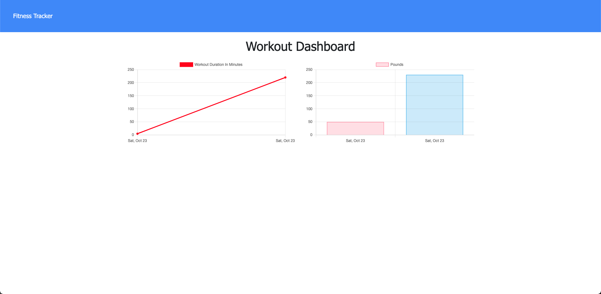
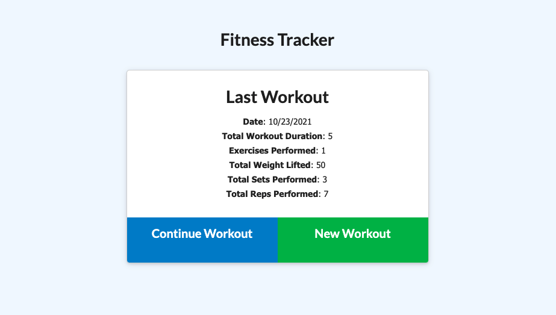

# Fitness-Tracker

## Description
This app was intended for those who wanted to stay fit, and keep track of their workouts.
Exercises are split into resistance and cardio which collectively can keep track of name, duration, weight, reps, sets, and distance.
The user can view their total weight lifted and total distance from the 7 most recent workouts. I chose the #7 because I am under the assumption that the user will log their data for the following week,
thus giving the user an accurate viewing of their progress.

## Deployed Application
https://fitness-tracker-dn.herokuapp.com/





## User Story
```
As a user,
I want to be able to view create and track daily workouts. 
I want to be able to log multiple exercises in a workout on a given day. 
I should also be able to track the name, type, weight, sets, reps, and duration of exercise. 
If the exercise is a cardio exercise, I should be able to track my distance traveled.
```

## Technologies
- Express.js
- MongoDB
- Mongoose
- Node.js

## Contact Me
You can check out my other work on GitHub at [DN-Vanguard](https://github.com/DN-Vanguard).